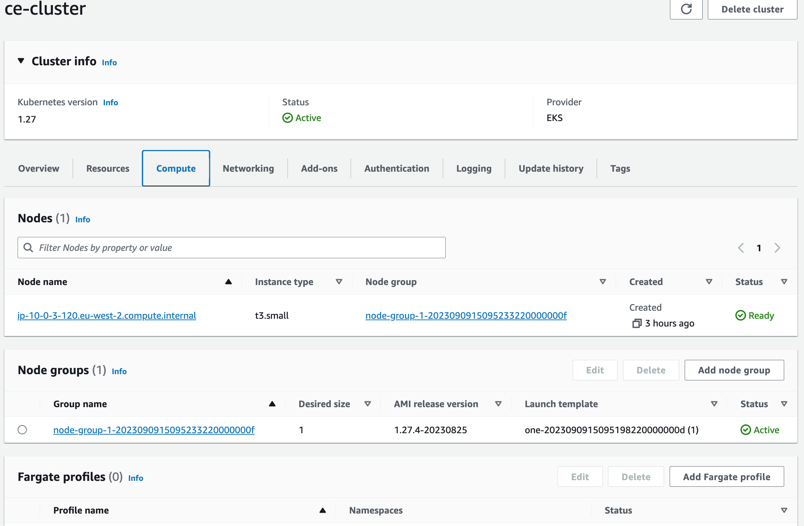
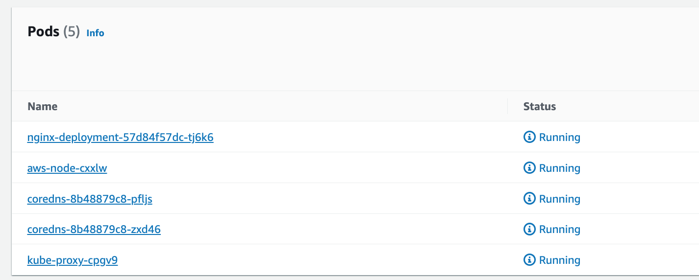
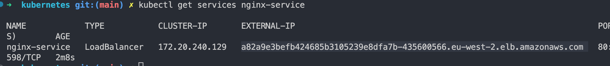
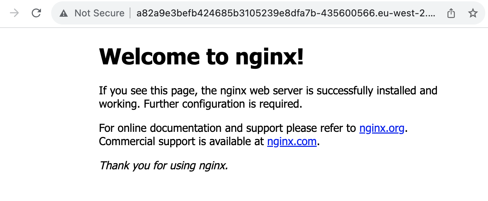

# EKS-Project
Kubernetes cluster on AWS using Elastic Kubernetes Service (EKS) and Terraform


## [Table of Contents](#table-of-contents)

- [Description](#description)
- [Final Result](#final-result)
- [Installation](#installation)
- [License](#license)
- [Contact Me](#contact)

## [Description](#table-of-contents)

This project demonstrates the creation and management of a Kubernetes cluster on Amazon Web Services (AWS) using Elastic Kubernetes Service (EKS) and Terraform. The infrastructure is provisioned, and Kubernetes resources are deployed to demonstrate a basic setup.

`Technologies used:`

- Terraform
- Kubernetes
- AWS
- Elastic Kubernetes Service (EKS)
- Nginx


## [Final Result](#table-of-contents)

The final result of this project includes:

- A fully provisioned Kubernetes cluster on AWS EKS.
- Deployment of sample Kubernetes resources, such as pods and services.
- Basic configurations for getting started with Kubernetes on EKS.

Here is the *EKS cluster* with a  single *node group* that contains a single  *node worker* that is located in a private subnet, running a *containerised* web application (Nginx web server in this case)






## [Installation](#installation)

To run this project, you need the following prerequisites:

- AWS CLI configured with the necessary IAM permissions.

- Terraform installed on your local machine.

- kubectl installed and configured to connect to your EKS cluster.

- Basic knowledge of Kubernetes and AWS services.

Follow these steps to deploy this project:

- Clone this repository to your local machine.

- Authenticate Terraform with your AWS credentials

- Provision the AWS resources and deploy the Kubernetes cluster using Terraform. Review the terraform directory for configuration files:
```
cd terraform
terraform init
terraform plan
terraform apply

```

- Wait for the cluster to be provisioned (this may take some time).

- Configure kubectl to interact with the newly created EKS cluster:
```
aws eks --region $(terraform output -raw region) update-kubeconfig \
    --name $(terraform output -raw cluster_name)
```
- Verify that kubectl can connect - try something like `kubectl get services` or `kubectl get nodes`.

- Deploy your Kubernetes applications and services. You can use the provided Kubernetes YAML files or create your own:
```
kubectl apply -f deployment.yaml
kubectl apply -f service.yaml
```

- Check the status:

Wait for a few moments until the service is provisioned. You can check the status of your service and the external IP address using the following command:

`kubectl get services nginx-service`



- Once you see an external IP address (under the EXTERNAL-IP column), you can access your NGINX service over the public internet using that IP address.



- Tearing things down:

Firstly make sure to remove any kubernetes services

```
kubectl delete -f deployment.yaml
kubectl delete -f service.yaml
```

You should then be able to run `terraform destroy` to remove all the infrastructure.


## [License](#table-of-contents)

This project is licensed under the:

[MIT license](https://choosealicense.com/licenses/MIT)


## [Contact Me](#table-of-contents)

If you have any questions or would like to get in touch, please feel free to contact 

- [GitHub: cdrcar](https://github.com/cdrcar)


